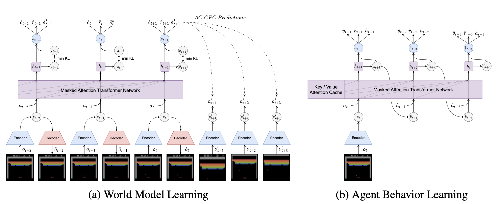

# Learning Transformer-based World Models with Contrastive Predictive Coding (TWISTER)

This is the official repository of TWISTER (Transformer-based World model wIth contraSTivE Representations).

**Read TWISTER paper on [OpenReview](https://openreview.net/forum?id=YK9G4Htdew) |
[Arxiv](https://arxiv.org/abs/2503.04416)**


## Method

We introduce TWISTER, a Transformer model-based reinforcement learning algorithm using action-conditioned Contrastive Predictive Coding (AC-CPC) to learn high-level feature representations and improve the agent performance. We evaluate our method on the commonly used Atari 100k benchmark and DeepMind Control Suite, demonstrating stronger performance in both discrete and continuous action spaces.



The world model learns feature representations by maximizing the mutual information between model states and future stochastic states obtained from augmented views of image observations. The encoder network converts image observations into stochastic states, from which a decoder network learns to reconstruct images while the masked attention Transformer network predicts next episode continuations, rewards and stochastic states conditioned on selected actions. The actor and critic networks are trained in latent space with imaginary trajectories generated from the world model to select actions maximizing the expected sum of future rewards.

## Installation

Clone GitHub repository and set up environment
```
git clone https://github.com/burchim/TWISTER && cd TWISTER
./install.sh
```

## Training

### Atari100k Benchmark

The agent can be trained on specific tasks using the 'env_name' variable, which defines the training environment. Training logs, replay buffer and checkpoints will be saved to callbacks/run_name/env_name. 

```
env_name=atari100k-alien run_name=atari100k python3 main.py
```

### DeepMind Control Suite

We also provide the implementation for training on DeepMind Control tasks.

```
env_name=dmc-Acrobot-swingup run_name=dmc python3 main.py
```

### Visualize experiments

```
tensorboard --logdir ./callbacks
```

### Override hyperparameters

Overriding model config hyperparameters:

```
env_name=atari100k-alien run_name=atari100k override_config='{"num_envs": 4, "epochs": 100, "eval_episode_saving_path": "./videos"}' python3 main.py
```

## Evaluation

'--mode evaluation' can be used to evaluate agents. The '--load_last' flag will scan the log directory to load the last checkpoint. '--checkpoint' can also be used to load a specific '.ckpt' checkpoint file.

```
env_name=atari100k-alien run_name=atari100k python3 main.py --load_last --mode evaluation
```

## Script options

```
# Args
-c / --config_file           type=str   default="configs/twister.py"    help="Python configuration file containing model hyperparameters"
-m / --mode                  type=str   default="training"              help="Mode: training, evaluation, pass"
-i / --checkpoint            type=str   default=None                    help="Load model from checkpoint name"
--cpu                        action="store_true"                        help="Load model on cpu"
--load_last                  action="store_true"                        help="Load last model checkpoint"
--wandb                      action="store_true",                       help="Initialize wandb logging"
--verbose_progress_bar       type=int,  default=1,                      help="Verbose level of progress bar display"

# Training
--saving_period_epoch        type=int   default=1                       help="Model saving every 'n' epochs"
--log_figure_period_step     type=int   default=None                    help="Log figure every 'n' steps"
--log_figure_period_epoch    type=int   default=1                       help="Log figure every 'n' epochs"
--step_log_period            type=int   default=100                     help="Training step log period"
--keep_last_k                type=int,  default=3,                      help="Keep last k checkpoints"

# Eval
--eval_period_epoch          type=int   default=1                       help="Model evaluation every 'n' epochs"
--eval_period_step           type=int   default=None                    help="Model evaluation every 'n' steps"

# Info
--show_dict                  action="store_true"                        help="Show model dict summary"
--show_modules               action="store_true"                        help="Show model named modules"

# Debug
--detect_anomaly             action="store_true"                        help="Enable or disable the autograd anomaly detection"
```

## Citation

If this code or paper is helpful in your research, please use the following citation:

```
@inproceedings{burchilearning,
  title={Learning Transformer-based World Models with Contrastive Predictive Coding},
  author={Burchi, Maxime and Timofte, Radu},
  booktitle={The Thirteenth International Conference on Learning Representations}
}
```

## Acknowledgments

Official DreamerV3 Implementation: [https://github.com/danijar/dreamerv3](https://github.com/danijar/dreamerv3)